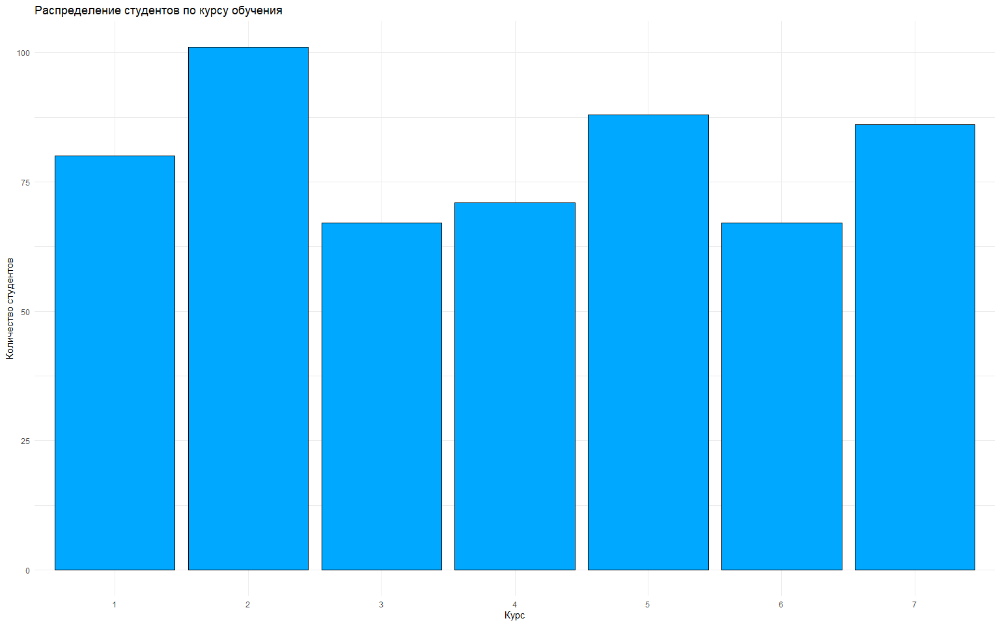
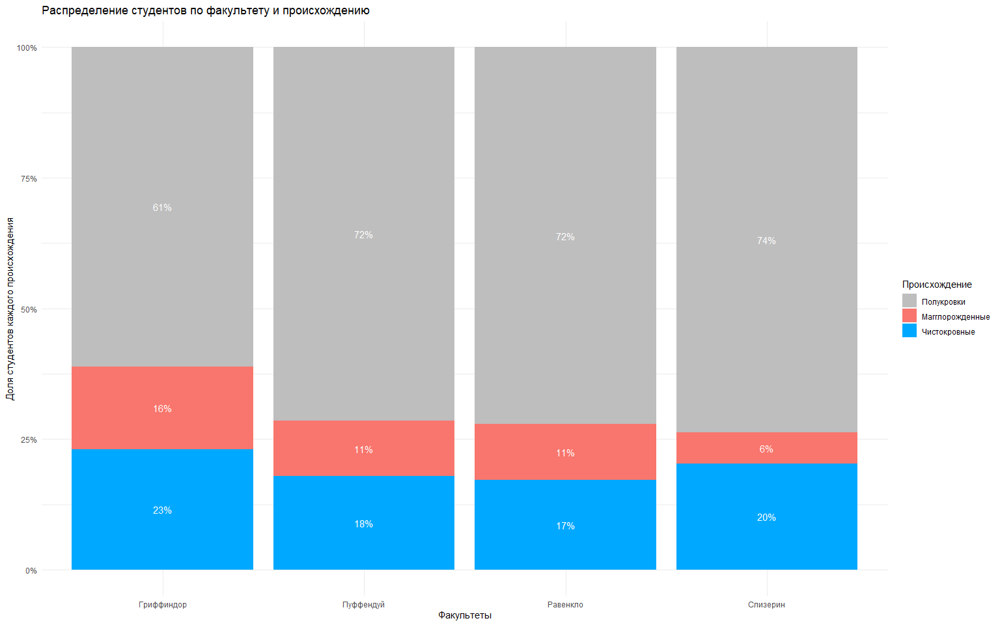
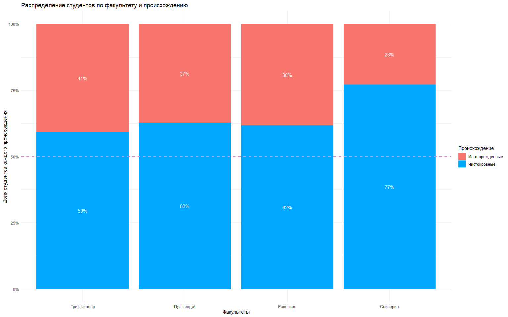
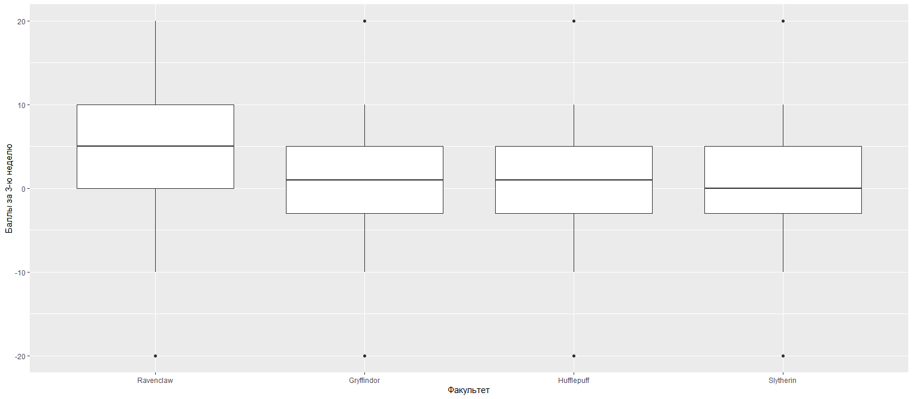
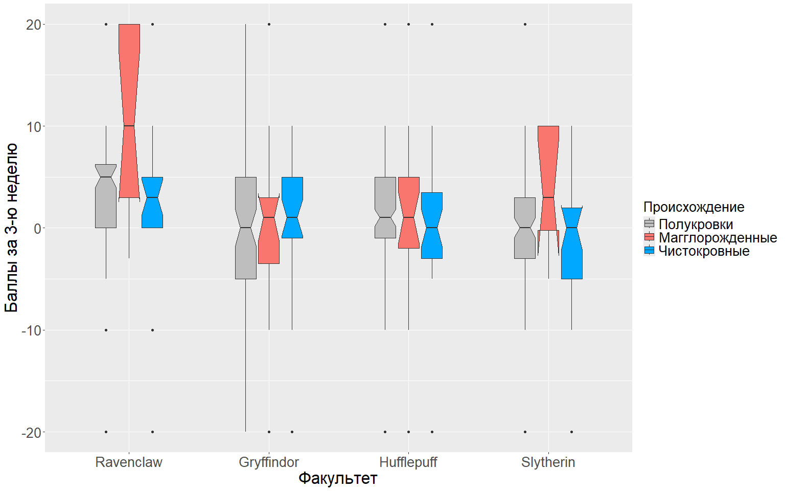
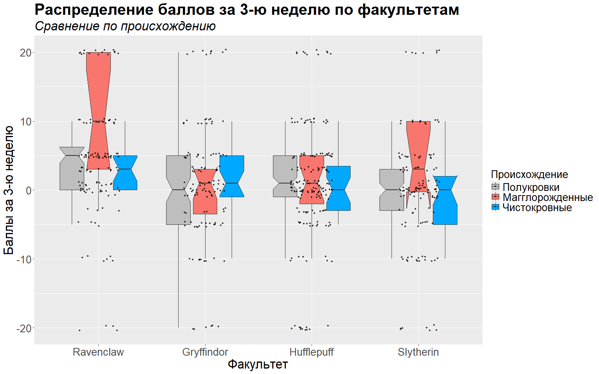
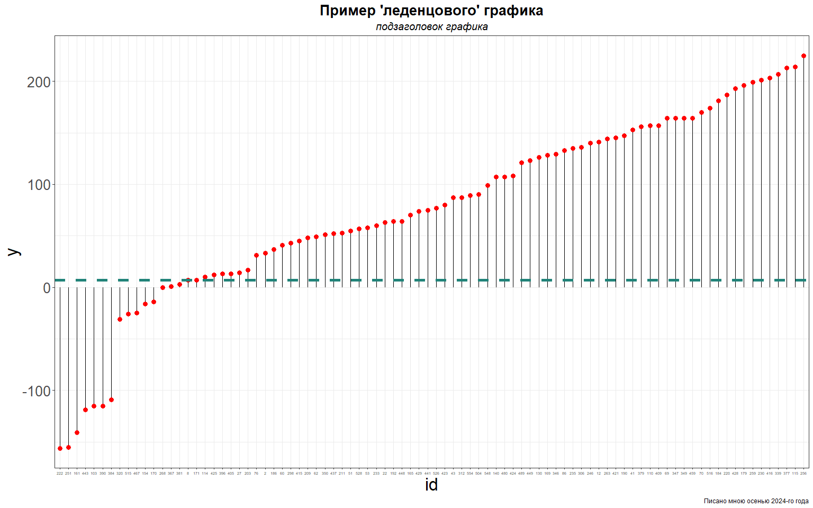
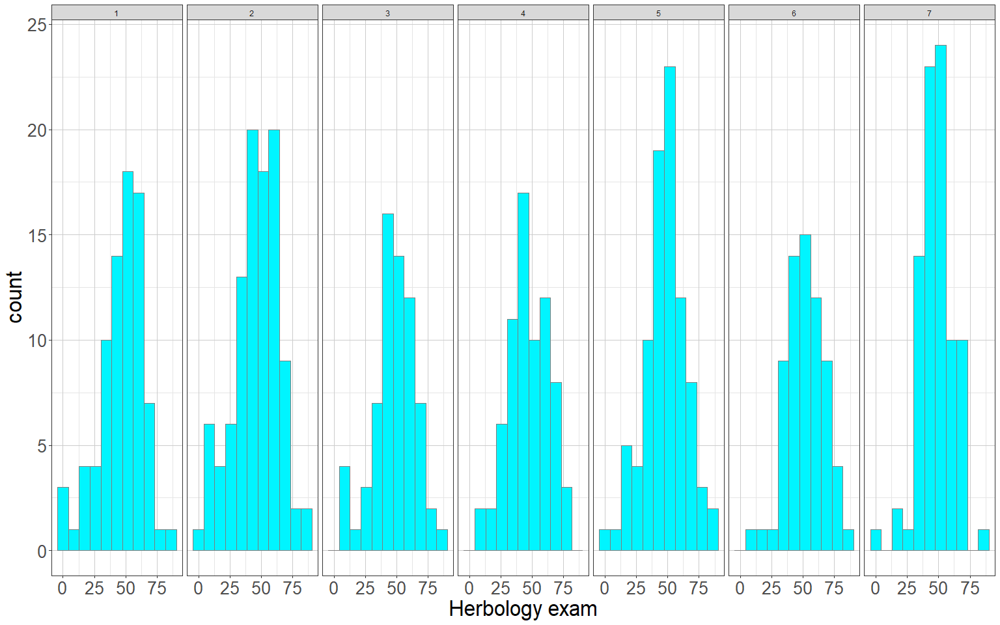
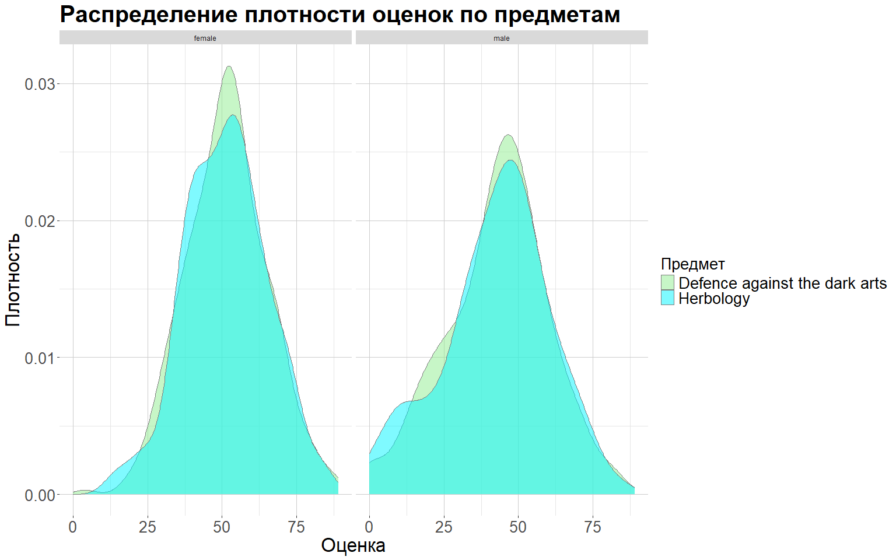

Katerina Lind
2024-09-28

### Basic data visualisation

This document is created as a homework for the class on data
visualisation, which is due to 28.09.24

Downloading the dataset

## Data reading

``` r
# Changing some variables type to factors
hogwarts <- hogwarts |> mutate(
  across(c(house, course, sex, bloodStatus), ~ as.factor(.x))
)
```

# 1. Столбчатые диаграммы

### Задание 1.1

Постройте барплот (столбчатую диаграмму), отражающую распределение числа
студентов по курсу обучения. Примените любую из встроенных тем ggplot.
Раскрасьте столбики любым понравившимся вам цветом (можно использовать
как словесные обозначения, так и гекскоды). Добавьте цвет контура
столбиков. (1 б).

``` r
# Basic barplot
ggplot(hogwarts, aes(x = course                               )) +
  geom_bar(fill = "#00A9FF", color = "black") +  # Defining the colors
  theme_minimal() +  # Applying the theme
  labs(title = "Распределение студентов по курсу обучения",
       x = "Курс",
       y = "Количество студентов")
```

<!-- -->

### Задание 1.2

Создайте новый барплот, отражающий распределение числа студентов по
факультету. Добавьте на график вторую факторную переменную –
происхождение (bloodStatus). Модифицируйте при помощи аргумента position
графика так, чтобы каждый столбец показывал распределение факультета по
чистоте крови в долях. Примените произвольную тему. Запишите текстом в
rmd-документе, какой вывод можно сделать из графика? (1 б).

``` r
# Calculate the percentages
hogwarts_p <- hogwarts %>%
  group_by(house) %>%
  count(bloodStatus) %>%
  mutate(percentage = n / sum(n) * 100) %>%
  ungroup()

# Plot the results
ggplot(hogwarts_p, aes(fill = bloodStatus, x = house, y = percentage)) + 
  geom_bar(position = "fill", stat = "identity") +
  geom_text(
    aes(label = paste0(round(percentage), "%")),
    position = position_fill(vjust = 0.5),
    color = "white",
    size = 4
  ) +
  scale_y_continuous(labels = scales::percent) +
  labs(title = "Распределение студентов по факультету и происхождению",
       x = "Факультеты",
       y = "Доля студентов каждого происхождения",
       fill = "Происхождение") +
  scale_fill_manual(values = c("pure-blood" = "#00A9FF", "muggle-born" = "#F8766D", "half-blood" = "grey"),
                    labels = c("pure-blood" = "Чистокровные", "muggle-born" = "Магглорожденные", "half-blood" = "Полукровки")) +
  scale_x_discrete(labels = c("Gryffindor" = "Гриффиндор", 
                               "Hufflepuff" = "Пуффендуй", 
                               "Ravenclaw" = "Равенкло", 
                               "Slytherin" = "Слизерин")) +
  theme_minimal()
```

<!-- -->

    ## Средний процент студентов из семей магов: 19.5 (± 2.6)

    ## Средний процент студентов из семей маглов: 11.0 (± 4.1)

    ## Средний процент студентов из смешанных семей: 69.8 (± 5.9)

Диаграмма показывает, что студенты из смешанных семей составляют
большинство на всех факультетах. Средний процент таких студентов
составляет 69.8% (± 5.9). Максимальная доля таких студентов учиться на
факультете Слизенри (74%) и наименьшая доля – на факультете Гриффиндор
(61%).

На втором месте по численности стоят студенты из семей магов, средние
процент таких учащихся на каждом факультете составляет 19.5 (± 2.6).
Гриффиндор является лидером по количеству студентов из данной категории,
они составляют 16% от всех учащихся факультета. На втором месте по доле
учащихся из семей магов стоит Слизерин (20%). Пуффендуй и Равенкло делят
между стобой третье место – доля студентов их семей магов составляет 11%
на том и другом факультетах.

Самая малочисленная группа – это студенты из семей маглов. Их средняя
доля на каждом факультете составляет 10.8%. Наимбольший процент таких
студентов учиится на факультете Грифенндор (16%), несколько меньше на
факультетах Пуффендуй и Равенкло (по 11% на каждом). Наименьшая доля
студентов из семей маглов обучается на факультете Слизерин (6%)

Самый маленькая разница между чистокровными и маглорождеными студентами
оказалась на факультете Равенкло - 6%. На факультетах Гриффиндор и
Пуффендуй разница между двумя категориями состовляет 7%. Самый большой
разрыв между категориями в 14% отмечается на факультете Слизерин.

### Задание 1.3

Модифицируйте датасет таким образом, чтобы в нем остались только
чистокровные (pure-blood) и маглорожденные студенты (muggle-born).
Создайте на основе этих данных график из пункта 2. Добавьте
горизонтальную пунктирную линию произвольного цвета на уровне 50%. Дайте
осям название на русском языке (1б). Дополнительно: переименуйте на
русский язык категории легенды pure-blood и muggle-born (0.5 б).

``` r
# filter the ds
hogwarts_fi <- subset(hogwarts, bloodStatus %in% c("pure-blood", "muggle-born"))

# Calculate the percentages
hogwarts_fip <- hogwarts_fi %>%
  group_by(house) %>%
  count(bloodStatus) %>%
  mutate(percentage = n / sum(n) * 100) %>%
  ungroup()

# Plot the results
ggplot(hogwarts_fip, aes(fill = bloodStatus, x = house, y = percentage)) + 
  geom_bar(position = "fill", stat = "identity") +
   geom_hline(yintercept = 0.5, linetype = "dashed", size = 1, color = "violet") +
  geom_text(
    aes(label = paste0(round(percentage), "%")),
    position = position_fill(vjust = 0.5),
    color = "white",
    size = 4
  ) +
  scale_y_continuous(labels = scales::percent) +
  labs(title = "Распределение студентов по факультету и происхождению",
       x = "Факультеты",
       y = "Доля студентов каждого происхождения",
       fill = "Происхождение") +
  scale_fill_manual(values = c("pure-blood" = "#00A9FF", "muggle-born" = "#F8766D"),
                    labels = c("pure-blood" = "Чистокровные", "muggle-born" = "Магглорожденные")) +
  scale_x_discrete(labels = c("Gryffindor" = "Гриффиндор", 
                               "Hufflepuff" = "Пуффендуй", 
                               "Ravenclaw" = "Равенкло", 
                               "Slytherin" = "Слизерин")) +
  theme_minimal()
```

<!-- -->

# 2. Боксплоты

### Задание 2.1

Отобразите распределение баллов, заработанных студентами на 3-й неделе
обучения, по факультетам. Отсортируйте факультеты в порядке убывания
медианного балла за 3-ю неделю (мы не останавливались на этом в лекции,
но упомянутая в ней функция по умолчанию сортирует именно по медиане,
так что в этом случае дополнительных аргументов передавать не следует).
(1 б.)

``` r
ggplot(hogwarts, aes(x = reorder(house, desc(week_3), FUN = median), y = week_3)) +
  geom_boxplot() +
  xlab("Факультет") +
  ylab("Баллы за 3-ю неделю")
```

<!-- -->

### Задание 2.2

Добавьте отображение разными цветами для происхождения студентов
(bloodStatus). Добавьте на боксплот вырезку (notch). Настройте для
данного чанка размер изображения 14:14 дюймов. Приведите названия осей к
корректному виду. (1 б.)

``` r
options(repr.plot.width = 14, repr.plot.height = 14)

library(ggplot2)

# Создание графика
ggplot(hogwarts, aes(x = reorder(house, desc(week_3), FUN = median), y = week_3, fill = bloodStatus)) +
  geom_boxplot(notch = TRUE, width = 0.5) + # Уменьшение ширины боксов
  labs(x = "Факультет", y = "Баллы за 3-ю неделю", fill = "Происхождение") +
  scale_fill_manual(values = c("pure-blood" = "#00A9FF", 
                                "muggle-born" = "#F8766D", 
                                "half-blood" = "grey"),
                    labels = c("pure-blood" = "Чистокровные", 
                               "muggle-born" = "Магглорожденные", 
                               "half-blood" = "Полукровки")) +
  theme_custom1
```

<!-- -->

### Задание 2.3

Добавьте на график джиттер-плот. Удалите отображение выбросов у
боксплота. Видоизмените по своему вкусу толщину линий и ширину
боксплота. (1 б.) Дополнительно: Добавьте название графика и подпись
(0.5 б.)

``` r
ggplot(hogwarts, aes(x = reorder(house, desc(week_3), FUN = median), y = week_3, fill = bloodStatus)) +
  geom_boxplot(notch = TRUE, outlier.shape = NA) + 
  geom_jitter(width = 0.2, size = 1.0, alpha = 0.7) + 
  labs(title = "Распределение баллов за 3-ю неделю по факультетам", 
       subtitle = "Сравнение по происхождению",
       x = "Факультет", 
       y = "Баллы за 3-ю неделю", 
       fill = "Происхождение") +
  scale_fill_manual(values = c("pure-blood" = "#00A9FF", 
                                "muggle-born" = "#F8766D", 
                                "half-blood" = "grey"),
                    labels = c("pure-blood" = "Чистокровные", 
                               "muggle-born" = "Магглорожденные", 
                               "half-blood" = "Полукровки")) +
    theme_custom1
```

<!-- -->

# 3. Разное

### Задание 3.1

Постройте “леденцовый график” (lollipop-plot) для количества набранных
студентами 5-го курса баллов за весь учебный год (по оси ординат – id
студента, по оси абсцисс – итоговый балл). Отсортируйте студентов в
порядке убывания итогового балла. Раскрасьте точки на “леденцах” в
зависимости от сердцевины волшебной палочки. Палочки с сердечной жилой
дракона должны быть красного цвета, с пером феникса – желтого, с волосом
единорога – серого. (1 б.)

``` r
hogwarts$final <- rowSums(hogwarts[, paste0("week_", 1:40)], na.rm = TRUE)
  


hogwarts |> 
  filter(course == 5) |> 
  mutate(id = as.factor(id)) |> 
  ggplot()+
  geom_segment(aes(x = fct_reorder(id, final), 
                   xend = fct_reorder(id, final), 
                   y = 0, 
                   yend = final))+
  geom_point(aes(x = fct_reorder(id, final), 
                 y = final), 
             colour = "red", 
             size = 3)+
  geom_hline(yintercept = 7, 
             linetype = "dashed", 
             linewidth = 2, 
             colour = "#218379")+
  labs(x = "id",
       title = "Пример 'леденцового' графика",
       subtitle = "подзаголовок графика",
       caption = "Писано мною осенью 2024-го года")+
  theme_bw()+
  theme_custom1 +
  theme(
    plot.title = element_text(size = 20, hjust = 0.5),
    plot.subtitle = element_text(size = 15, hjust = 0.5),
    axis.text.x = element_text(size = 5)
    
  )
```

<!-- --> \###
Задание 3.2 Постройте гистограмму распредления баллов за экзамен по
астрономии. Выделите цветом факультет Слизерин. Примените 18-й кегль к
тексту на осях x, y и легенды. Название оси y и легенды запишите 20-м
кеглем, оси x – 22-м. Измените название оси y на “Number of students”.
(1 б.)

``` r
ggplot(hogwarts, aes(x = `Astronomy exam`, fill = house)) +
  geom_histogram(binwidth = 1, color = "black") +
  scale_fill_manual(values = c("Gryffindor" = "grey", 
                                "Slytherin" = "green", 
                                "Hufflepuff" = "grey", 
                                "Ravenclaw" = "grey")) +
  labs(x = "Баллы", y = "Number of students") +
  theme(axis.text.x = element_text(size = 18),
        axis.text.y = element_text(size = 18),
        legend.text = element_text(size = 20),
        axis.title.x = element_text(size = 22),
        axis.title.y = element_text(size = 20))
```

<!-- -->

### Задание 3.3

На лекции мы использовали комбинацию theme_bw(), и созданной нами
theme_custom, чтобы одновременно сделать фон белым и увеличить шрифт.
Модифицируйте theme_custom таким образом, чтобы она и выполняла свои
прежние функции, и делала фон белым без помощи theme_bw(). Примените
новую кастомную тему к графику, полученному в последнем пункте блока по
боксплотам (1.5 б).

``` r
ggplot(hogwarts, aes(x = `Astronomy exam`, fill = house)) +
  geom_histogram(binwidth = 1, color = "black") +
  scale_fill_manual(values = c("Gryffindor" = "grey", 
                                "Slytherin" = "green", 
                                "Hufflepuff" = "grey", 
                                "Ravenclaw" = "grey")) +
  labs(x = "Баллы", y = "Number of students") +
  theme(axis.text.x = element_text(size = 18),
        axis.text.y = element_text(size = 18),
        legend.text = element_text(size = 20),
        axis.title.x = element_text(size = 22),
        axis.title.y = element_text(size = 20))+
  theme_custom
```

<!-- -->

# 4. Фасетирование

### Задание 4.1

Напишите, какой, по вашему мнению, способ фасетирования (по строкам или
по столбцам) лучше использовать для визуализации гистограммы. Почему? А
какой для визуализации violin-plot? Почему? Можно ли вывести общее
правило? (1.5 б)

Выбор способа фасетирования (по строкам или по столбцам) зависит от
структуры дынных и целей сравнения.

Гистограммы я фасетировала с помощью facet_grid, так как у меня было
много уровней факторной переменной (7 уровней). Визуально столько
уровней было сравнивать легче при таком способе фасетирования.

Для Violin-plot я бы использовала фасетирование faced_wrap, чтобы
сохранить вертикальное пространство для отображения плотности
распределения, так как такие графики обычно вытянуты вертикально.

Общее правило - при большом количестве уровней, лучше читается
фасетирование с помощью facet_grid. Если же уровней не много, но
требуется пространство для визуализации можно использовать faced_wrap.

### Задание 4.2

Постройте гистограмму для результата любого выбранного вами экзамена,
кроме зельеварения. Настройте оптимальное на ваш взгляд число столбцов
гистограммы. Выполните фасетирование по курсу. Постарайтесь, чтобы
график был по возможности компактным. (1 б.).

``` r
ggplot(hogwarts) +
  geom_histogram(aes(x = `Herbology exam`), 
                 fill = "turquoise1", 
                 colour = "grey49", 
                 bins = ceiling(log2(nrow(hogwarts)) + 1)) +
  theme_bw() +
  facet_grid(~ course) +
  theme_custom
```

<!-- -->

### Задание 4.3

Отобразите на одном графике распределение плотности вероятности для
оценки студентов на экзамене по защите от темных искусств и на экзамене
по травологии. Раскрасьте их в любые выбранные вами цвета, постарайтесь,
чтобы оба распределения отображались целиком. Примените тему из 3-го
пункта блока “Разное”. Сделайте фасетирование по полу (1 б.).

``` r
ggplot(hogwarts) +
  geom_density(aes(x = `Defence against the dark arts exam`, fill = "Defence against the dark arts"), 
               colour = "grey49", 
               alpha = 0.5, 
               bins = ceiling(log2(nrow(hogwarts)) + 1)) +
  geom_density(aes(x = `Herbology exam`, fill = "Herbology"), 
               colour = "grey49", 
               alpha = 0.5, 
               bins = ceiling(log2(nrow(hogwarts)) + 1)) +
  facet_grid(~ sex) +
  labs(title = "Распределение плотности оценок по предметам",
       x = "Оценка",
       y = "Плотность",
       fill = "Предмет") +  # Заголовок для легенды
  scale_fill_manual(values = c("Defence against the dark arts" = "lightgreen", 
                                "Herbology" = "turquoise1"))+
  theme_custom
```

<!-- -->
